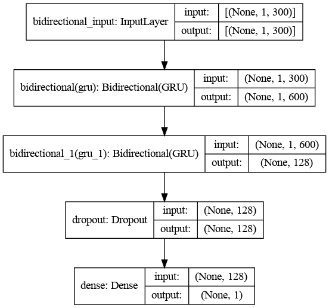
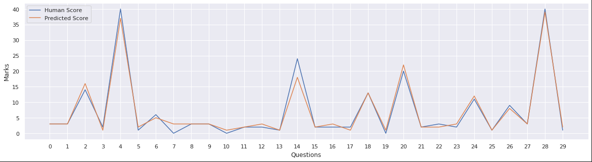

This repository contains the implementation of Automatic Evaluation of Textual Descriptive Answers on the famous Automated Essay Scoring (AES) dataset downloaded from [here](https://www.kaggle.com/thevirusx3/automated-essay-scoring-dataset) on Kaggle.

The Sequential API from Keras has been used as a classifier model. The following flow diagram shows the model.

The model performs quite well in terms of Cohen's Kappa score and achieves an average score of about 0.96

A line graph showing 30 randomly selected questions and their predicted counterparts by the model is shown below:

The data used is in un-normalized form i.e., the target scores are not in a constant range.
